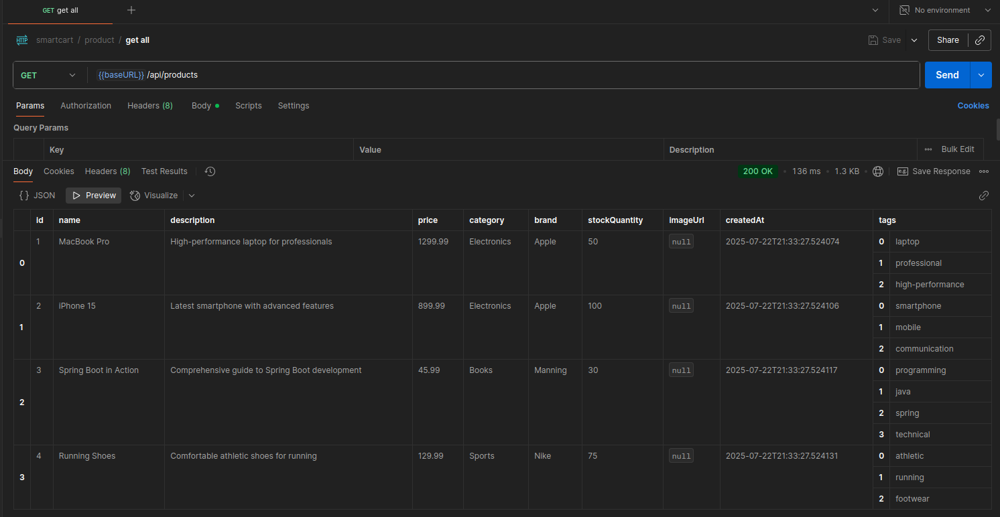

# 🛒 SmartCart Pro
### AI-Powered E-commerce Platform with Spring Boot & Spring AI

SmartCart Pro is a modern e-commerce application that leverages artificial intelligence to provide intelligent product recommendations, smart search capabilities, and automated content generation. Built with Spring Boot and integrated with Spring AI for enhanced shopping experiences.

## 🌟 Features Overview

### Core E-commerce Features
- **Product Management** - CRUD operations for products
- **Customer Management** - User profiles with preferences and purchase history
- **Category & Brand Filtering** - Organized product browsing
- **Real-time Inventory** - Stock quantity tracking

### 🤖 AI-Powered Features
- **Smart Product Recommendations** - Personalized suggestions based on customer behavior
- **Intelligent Search** - AI-enhanced search that understands user intent
- **Automated Content Generation** - AI-generated product descriptions
- **Semantic Product Discovery** - Find products even with vague search terms

## 🚀 Quick Start

### Prerequisites
- Java 17+
- Maven 3.6+
- OpenAI API Key - optional if using ollama

### Installation

1. **Clone the repository**
   ```bash
   git clone https://github.com/Dancan254/smartcart.git
   cd smartcart
   ```

2. **Set up environment variables**
   ```bash
   export OPENAI_API_KEY=your-openai-api-key-here
   ```
   - skip this step if using ollama


3. **Run the application**
   ```bash
   mvn spring-boot:run
   ```

4. **Access the application**
    - API Base URL: `http://localhost:8080/api`
    - H2 Console: `http://localhost:8080/h2-console`
    - Database URL: `jdbc:h2:mem:ecommerce`

## 📚 API Documentation

### Products API

#### Get All Products
```http
GET /api/products
```



Returns a complete list of all products with their details including price, category, stock status, and AI-generated metadata.

#### Search Products (AI-Enhanced)
```http
GET /api/products/search?query=your-search-term
```
Our intelligent search system works in three layers:
1. **Traditional Search** - Exact keyword matching


2. **Enhanced Query** - AI expands search terms for better results


3. **Semantic Search** - AI understands intent when keywords fail - for this ensure the embedding model is specified in your app.yml file.


#### Get Product Recommendations
```http
GET /api/products/recommendations/{customerId}
```


AI analyzes customer's:
- Purchase history
- Stated preferences
- Behavioral patterns
- Similar customer profiles

#### Generate AI Product Description

```http
POST /api/products/{productId}/generate-description
```


Creates compelling, SEO-optimized product descriptions using AI based on product attributes.

#### Filter by Category

```http
GET /api/products/category/{categoryName}
```


Browse products by specific categories like Electronics, Books, Sports, etc.

### Customers API

#### Create New Customer

```http
POST /api/customers
{
  "email": "customer@example.com",
  "firstName": "John",
  "lastName": "Doe"
}
```


#### Update Customer Preferences

```http
PUT /api/customers/{customerId}/preferences
Content-Type: application/json

["Electronics", "Books", "Sports"]
```
These preferences directly influence AI recommendation algorithms.

#### Get Customer Profile
**Screenshot Location**: [Attach screenshot of customer profile]

```http
GET /api/customers/{customerId}
```
View complete customer profile including preferences and purchase history.

## 🗄️ Database Schema

### Products Table
Key fields include AI-relevant metadata like tags and enhanced descriptions.

### Customers Table
Stores preference data and purchase history that feeds the recommendation engine.

## 🔧 Configuration

### Application Properties
The application uses Spring AI's OpenAI integration with configurable temperature settings for different AI tasks:
- **Recommendations**: Higher creativity (0.7)
- **Search Enhancement**: Balanced approach (0.5)
- **Content Generation**: Focused output (0.3)

## 📊 Sample Data

The application comes pre-loaded with sample data:

- 4 sample products across different categories
- 2 sample customers with different preferences
- Established purchase history for testing recommendations

## 🧪 Testing the AI Features

### Testing Recommendations
1. Use Customer ID 1 (John Doe - prefers Electronics, Books)
2. Call `/api/products/recommendations/1`
3. Observe how AI suggests related products

### Testing Intelligent Search

Try these search queries to see AI in action:
- "something for work" → Should find laptops, books
- "fitness gear" → Should find sports products
- "communication device" → Should find phones

### Testing Content Generation

1. Pick any product ID
2. Call `/api/products/{id}/generate-description`
3. Compare with original description

## 🚀 Next Steps & Extensions

### Potential Enhancements
- **Visual Search**: Upload images to find similar products
- **Chatbot Support**: AI-powered customer service
- **Dynamic Pricing**: AI-optimized pricing strategies
- **Review Sentiment**: AI analysis of customer reviews
- **Inventory Prediction**: AI-forecasted stock management

### Integration Opportunities
- **Payment Processing**: Stripe, PayPal integration
- **Email Marketing**: AI-generated personalized campaigns
- **Analytics Dashboard**: AI-powered business insights
- **Mobile App**: React Native with AI features

## 🤝 Contributing

1. Fork the repository
2. Create your feature branch (`git checkout -b feature/amazing-ai-feature`)
3. Commit your changes (`git commit -m 'Add amazing AI feature'`)
4. Push to the branch (`git push origin feature/amazing-ai-feature`)
5. Open a Pull Request

**SmartCart Pro** - Where E-commerce Meets Artificial Intelligence

*Built with ❤️ using Spring Boot, Spring AI, and OpenAI*